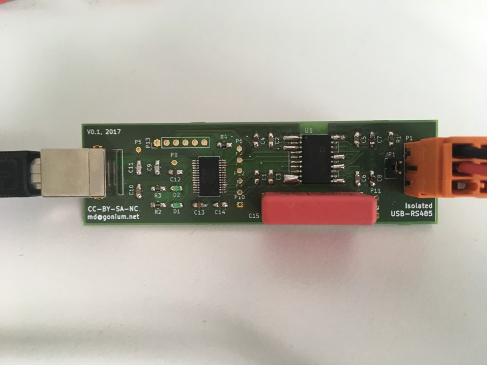
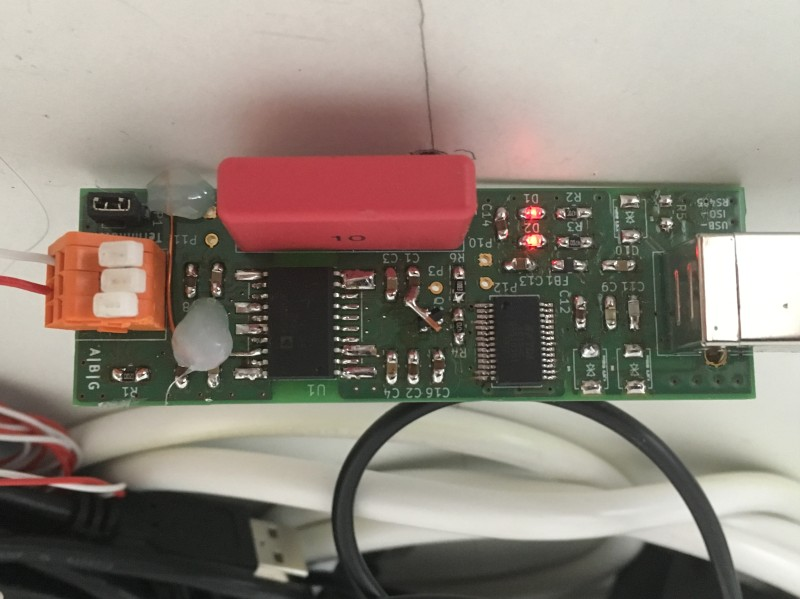

# An isolated USB-RS485 adapter

I connected a lot of USB-RS485 adapters to my [smart meter readout
software](https://github.com/gonium/gosdm630) and wasn't happy. Either
the device is cheap and broken or works but is very expensive. The
supercheap adaptors from China often provice no ground connection, one
worked fine, another one was unstable. Both did not adhere to the USB
spec (90mA initial current draw limit). On the other hand, industrial
adaptors like the Meilhaus RedCOM USB-COMi-SI or the ADAM 4561 isolate
the RS-485 bus from the USB line and work extremely reliable. But they
are really expensive.

This project aims to create an adaptor that works well and is reasonably
priced. We use the following components:

* An FTDI FT232L provides the USB-UART interface and can be configured
for RS485 operation.
* An [Analog Devices
ADM2582E](http://www.analog.com/media/en/technical-documentation/data-sheets/ADM2582E_2587E.pdf)
isolates the RS485 bus and generates the supply voltage for the bus.
Please note: this device is rather expensive, but Analog Devices will
send you samples at no cost.
* We use WAGO 233 series connectors to connect to the RS485 bus

The first prototype looks like this:

Currently, I have build the second prototype. Please note that the board
is slightly smaller, has a different WAGO connector and unpopulated
footprints for protection diodes:

The second prototype works quite well. Minor layout changes are needed,
but the principle is solid.

# TODO

* Copy all footprints to project library
* Footprint of MOSFET is wrong
* Increase hole diameter for WAGO connector
* Fix position of silkscreen on bottom layer

# FTDI configuration.

The FTDI chip needs to be configured in order to work in this
application. Specifically, the following changes need to be written into
its EEPROM:

* CBUS3 must be set to PwrEN. This ensures that the device draws only 90
mA when plugged in. After completing the USB enumeration process, this
pin triggers the onboard MOSFET and the remainder of the board is
powered up.
* CBUS4 must be set to TxDEN. The FTDI toggles the nRE pin of the ADM2582.

You can use [Mark Lord's ft232r_prog](http://rtr.ca/ft232r/) to change
the EEPROM settings. In order to see the current EEPROM content, use

    $ ft232r_prog --verbose --dump --old-vid 0x0403 --old-pid 0x6001

In order to set CBUS3 to PwrEN, CBUS4 to TxDEN, high-current-io off and
the maximum power consumption to 300 mA, use

    $ ft232r_prog --verbose --dump --old-vid 0x0403 --old-pid 0x6001 \
		--cbus3 PwrEn --cbus4 TxDEN --high-current-io off --max-bus-power 300

On Linux I could successfully compile the binary just by typing
``make`` and using it as described above. On Mac OS X, I needed to add
``/usr/local`` to the Makefile. The top two lines now read like this:

    CFLAGS = -Wall -O2 -s -Werror -I/usr/local/include
    LDFLAGS = -L/usr/local/lib -lusb -lftdi -s

In my case, a FTDI driver claimed the device, preventing the
``ft232r_prog`` command to communicate with the FTDI. You can list the
FTDI-related kernel extensions using

    $ kextstat | grep FTDI
		156    0 0xffffff7f83606000 0x8000     0x8000     com.FTDI.driver.FTDIUSBSerialDriver (2.2.16) 0AB01558-B114-9EF2-1CD9-A13CFA557737 <137 55 5 4 3 1>

Then, to unload the driver, use

    $ sudo kextunload -b com.FTDI.driver.FTDIUSBSerialDriver

for all FTDI drivers you found.
